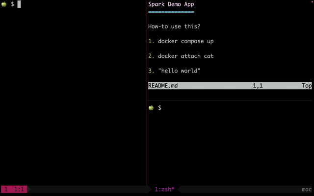

Spark Demo App
==============

How-to use this?

1. docker compose up

2. docker attach cat

3. "hello world"

Demo
----

See:

https://spark.apache.org/docs/latest/streaming-programming-guide.html

